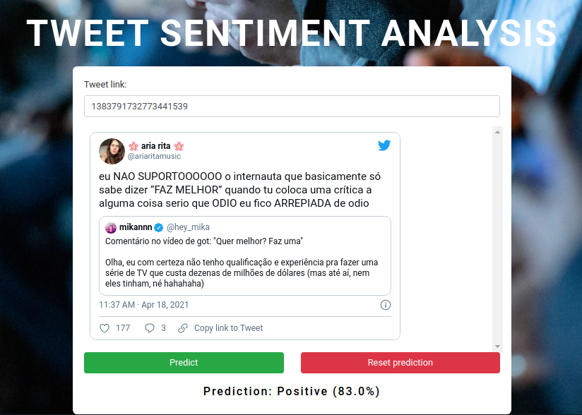

# tweets-classifier-flask-react
Classificador de tweets com um serviço flask e frontend em react.js



# Iniciando o projeto:
```bash
docker-compose build && docker-compose up
```

Se você for iniciar a aplicação em um servidor web, você vai precisar criar um arquivo `.env` no mesmo diretório do arquivo `docker-compose.yml` com a URL do serviço (api) que o frontend deve consumir, conforme exemplo abaixo:
```bash
API_URL=your-server-url:5000
```

Dessa forma, o `docker-compose` se responsabiliza de configurar a url do servidor definida ao invés de localhost para a aplicação React.